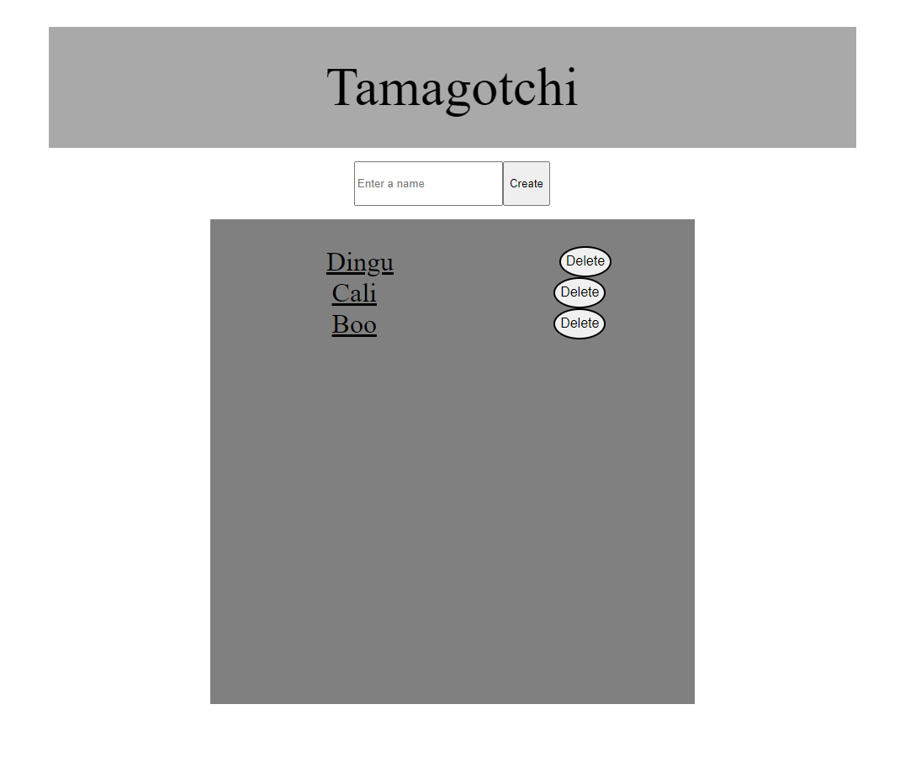
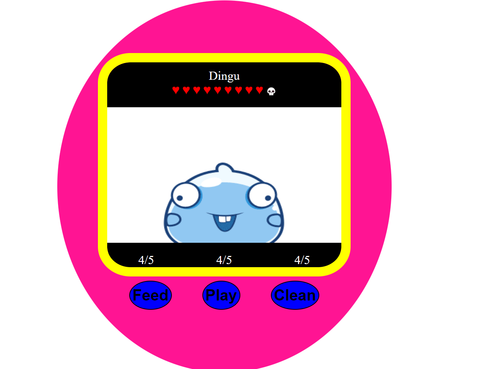

# Tamagotchi
This is a Tamagotchi game it has basic functionality of the toy or better known as a handheld digital pet popular in the 1980s.

# Tech Stack
Client: HTML, Css, JavaScript, Ejs

Server: Node, Express, Cors, Axios, Ejs, DB.json

# Features
- A text box to give the Tamagotchi a name
- Health bar
    - if drops all the way the Tamagotchi will die
- Hunger stats
    - A feed button
- Energy stats
    - A play button
- Hygiene stats
    - A clean button

# Screenshots

